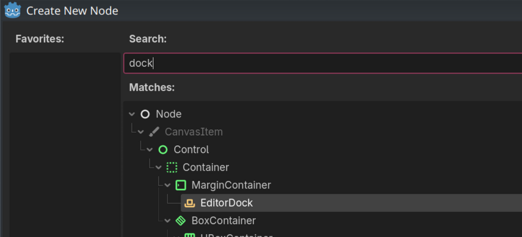

Extended Editor Plugin is a class intended to enhance your editor plugins. It is *not* a stand-alone plugin that you can use in your project, it's only useful if you yourself are making a plugin.

## Usage

Extended Editor Plugin intentionally comes with no class name and no UID, because each addon is supposed to keep its own copy of this class, to prevent conflicts in case of different versions.

To use it, copy `ExtendedEditorPlugin.gd` to the main directory of your plugin. Then in your own editor plugin, replace
```GDScript
extends EditorPlugin
```
with
```GDScript
extends "ExtendedEditorPlugin.gd"
```
Your plugin can now use methods of the extended plugin. For available functionality, refer to the sections below or the scripts documentation.

## Main screen docks

Extended Editor Plugin allows to use an EditorDock as an main screen and handless all boilerplate necessary for creating main screen plugins.

To use this functionality, you need to create an EditorDock. Since Godot 4.7, it's easy to make a scene with EditorDock as a root, and it's the recommended way to make docks. Search "EditorDock" when creating root node.



Then create an instance of that scene in your plugin and use `set_main_screen_dock()` to assign it. This has to be done in the `_init()` method of the plugin.

```GDScript
@tool
extends "ExtendedEditorPlugin.gd"

func _init():
    var dock: EditorDock = preload("MyDock.tscn").instantiate()
    set_main_screen_dock(dock)
```

Done. Extended Plugin will automatically set up the added dock as a main screen editor and remove it when the plugin is disabled, so you don't need to do anything else.

## Translations

The Extended Plugin comes with functionality that helps translating your plugin to other languages.

### Adding translations

To add language support, first you need a Translation resource. Refer to the Godot's manual for how to make one: https://docs.godotengine.org/en/latest/tutorials/i18n/index.html.

Afterwards, call `add_plugin_translation()` in the plugin's `_init()` method to register the translation. It will be added automatically to editor's translation list when the plugin is enabled, and removed when it's disabled. You can also use `add_plugin_translations_from_directory()` to add all translations from a directory.

```GDScript
@tool
extends "ExtendedEditorPlugin.gd"

func _init():
    add_plugin_translations_from_directory("res://addons/my_addon/translations")
```

The editor will use the registered translations when user is using a supported language.

### Extracting translations

Extended Plugin comes with a helper that allows for easier extracting of translations from the script. The engine's translation template generator will automatically extract strings inside `tr()` calls, but you don't always want them translated in place (to take advantage of Node's auto-translation feature). You can use the `tr_extract` object for such strings.

```GDScript
var item_list: ItemList = dock.get_node(^"ItemList")
item_list.add_item(tr_extract.tr("One"))
item_list.add_item(tr_extract.tr("Two"))
item_list.add_item(tr_extract.tr("Three"))
```

## Settings

Extended plugin provides methods for registering custom settings and conveniently tracking when they change.

### Registering settings

To create a project setting, use `define_project_setting()` method. To create an editor setting, use `define_editor_setting()`. Both take (almost) the same parameters:
- `name`: Path of the setting, e.g. `addons/my_addon/game_description`.
- `default_value`: The default value used when the user did not change the setting.
- `hint`: Property hint of the setting. Refer to the documentation of the engine's PropertyHint enum.
- `hint_string`: Hint string of the setting. Usage depends on the used hint.

These parameters are only available for project settings:
`basic`: If `true`, the setting appears without Advanced switch enabled.
`restart_if_changed`: If `true`, changing the setting will prompt editor restart.
`internal`: If `true`, the setting will not appear in the settings dialog.

Defining methods return the current value of the setting, in case it was modified by the user. You can cache the value in some variable for more efficient usage in the plugin. Like other things, it's best to define the settings in the `_init()` method, although it's not a strict requirement.

```GDScript
@tool
extends "ExtendedEditorPlugin.gd"

var game_description: String

func _init():
    game_description = define_project_setting("addons/my_addon/game_description", "", PROPERTY_HINT_MULTILINE_TEXT)
```

### Registering shortcuts

Registering shortcuts is similar to defining settings. The `register_editor_shortcut()` method takes:
- `path`: Slash-separated path of the shortcut, used to identify it. The editor uses the first 2 parts to display the shortcut in the Shortcuts tab.
- `name`: Name of the shortcut that shows in the editor. It will display in the settings dialog and in tooltips, if used in Buttons, PopupMenus etc. If empty, the second part of the `path` will be used as display name.
- `default`: The default keycode of the shortcut. Use `KEY_NONE` to not assign default. `KEY_MASK` constants can be used to apply modifiers.

Like with settings methods, registering a shortcut also returns a Shortcut object that you can use in your plugin.

```GDScript
@tool
extends "ExtendedEditorPlugin.gd"

var kill_switch: Shortcut

func _init():
    kill_switch = register_editor_shortcut("addons/my_addon/kill_switch", "Kill!", KEY_MASK_CMD_OR_CTRL | KEY_K)
```

### Tracking settings

After defining a custom setting, it's sometimes useful to track when their value change as a result of the user modifying it in the settings dialog (especially when the plugin caches the value). To do so, use `track_project_setting()` and `track_editor_setting()` methods. They take setting name as parameter.

When a setting is changed, the `_on_setting_changed()` callback is invoked, with the changed setting as an argument. You should override this method to react on changes.

```GDScript
@tool
extends "ExtendedEditorPlugin.gd"

var game_description: String

func _init():
    game_description = define_project_setting("addons/my_addon/game_description", "", PROPERTY_HINT_MULTILINE_TEXT)

func _on_setting_changed(setting: String, new_value: Variant) -> void:
    if setting == "addons/my_addon/game_description":
        game_description = new_value
```

`_on_setting_changed()` is only called when a tracked setting changes, so if you track only one setting, there is no need to check its name.
The project settings tracking has to be set up _after_ the settings are defined, otherwise the setting changed callback will be received immediately.